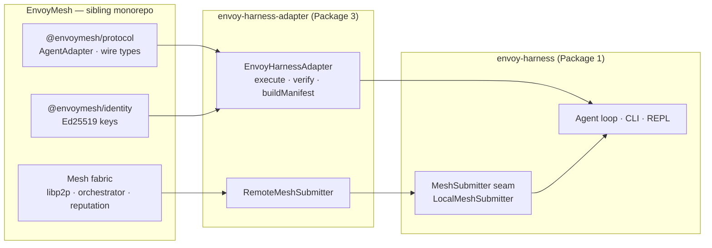
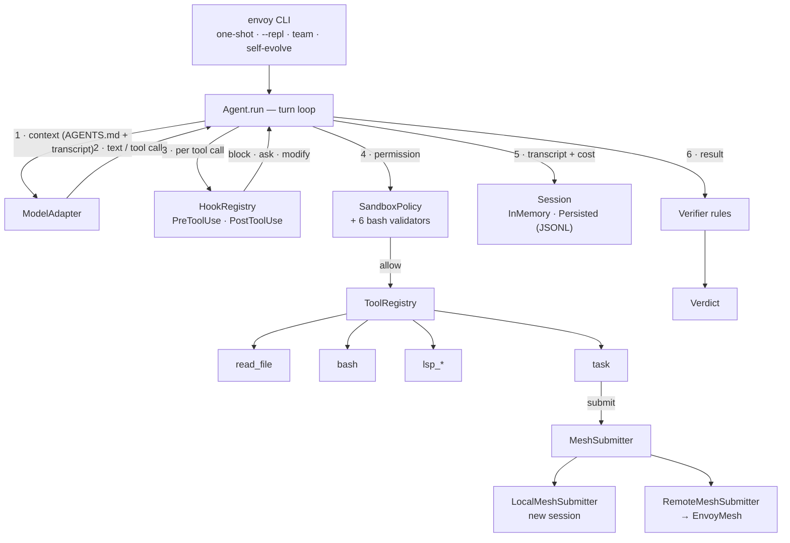

# envoy-harness

> **Monorepo.** This repo contains EnvoyMesh's home-team agent harness and
> its reference mesh adapter. Each package is independently published.
>
> **Status as of 2026-08-19:** Phases 0–7 complete (v0 spine, mesh-native
> adapters, self-evolution, production-grade tooling, mesh-native
> sub-agents, interactive REPL, persistent sessions + bundled F18 REPL
> commands). **1094 tests across 74 files**, all passing; typecheck clean.
> Plus 3 opt-in live tests under `pnpm test:live` (real network; off by default).

## Packages

| Package | Status | Description |
|---|---|---|
| [`@envoymesh/envoy-harness`](./packages/envoy-harness/README.md) | ✅ Phases 0–7 | The home-team agent harness — production-grade CLI agent, EnvoyMesh-native, independently runnable. The local runtime: agent loop, permissions, hooks, verifier, REPL, persistence, sub-agents. |
| [`@envoymesh/envoy-harness-adapter`](./packages/envoy-harness-adapter/README.md) | ✅ shipped | The reference MAP adapter (Package 3). The only code that knows both envoy-harness and the mesh: `EnvoyHarnessAdapter` (execute/verify/manifest) + `RemoteMeshSubmitter`. |
| `@envoymesh/protocol` (in [EnvoyMesh](https://github.com/allenpeng0705/EnvoyMesh)) | external | Package 2 — the MAP wire contract (`AgentAdapter`, manifest/result/verdict schemas). Not in this repo. |

The dependency direction is strictly one-way: `EnvoyMesh → envoy-harness-adapter → envoy-harness`.

## Architecture

### Package boundary



### Runtime flow

One `Agent.run()` turn, from prompt to result:



ASCII sketch of the same flow (for raw viewers):

```
user → envoy CLI ──> Agent.run (turn loop) ──> ModelAdapter (OpenAI/Anthropic/DeepSeek/Ollama)
                          │
                          ├─ tool_call ─> hooks ─> permission (6 bash validators) ─> tool
                          │                                        └─ task ─> MeshSubmitter
                          │                                                   ├─ LocalMeshSubmitter (new session)
                          │                                                   └─ RemoteMeshSubmitter ─> EnvoyMesh
                          ├─ transcript ─> Session (in-memory | persisted JSONL)
                          └─ result ─> verifier rules ─> verdict
```

The mesh bridge (Package 3) wraps the same loop for inbound work: EnvoyMesh
calls `EnvoyHarnessAdapter.execute()` → builds a fresh local `Agent` (its own
session, permission, tools) → runs the objective → signs the wire result.

## Layout

```
.
├── packages/
│   ├── envoy-harness/              # Package 1 — the CLI agent (Phases 0–7)
│   │   ├── src/
│   │   │   ├── agent.ts            # the turn loop
│   │   │   ├── cli/                # run · argv · repl/ (26 slash commands)
│   │   │   ├── session/            # PersistedSession + SessionStore (JSONL)
│   │   │   ├── permissions/        # 6 bash validators + shared SandboxPolicy
│   │   │   ├── hooks/              # 12 hook events + shell/module runners
│   │   │   ├── agents-md/          # AGENTS.md discovery (walk-up + concat)
│   │   │   ├── verifier/           # rule / llm / cross verdicts
│   │   │   ├── scoreboard/         # self-evolution + federated pull
│   │   │   ├── llm/                # OpenAI / Anthropic / DeepSeek adapters
│   │   │   ├── lsp/                # LSP client + 4 navigation tools
│   │   │   ├── team/               # TOML teams + topological runner
│   │   │   ├── trace/              # tracer + JSON Lines output
│   │   │   └── subagent/           # MeshSubmitter seam + fan-out
│   │   ├── test/                   # 939 tests across 57 files
│   │   ├── bin/                    # bin/envoy-harness.ts
│   │   └── docs/                   # design.{en,zh}.md · boundary · implementation-plan
│   └── envoy-harness-adapter/      # Package 3 — MAP bridge (93 tests / 10 files)
│       └── src/                    # EnvoyHarnessAdapter · RemoteMeshSubmitter
├── .github/workflows/ci.yml        # pnpm -r typecheck + test + build
├── pnpm-workspace.yaml
├── tsconfig.base.json
├── package.json                    # workspace root (private)
└── LICENSE
```

## Commands

```sh
pnpm install            # workspace install (hoists dev deps)
pnpm run typecheck      # tsc --noEmit across all packages
pnpm run test           # vitest run across all packages
pnpm run build          # tsc -p tsconfig.build.json across all packages
pnpm run envoy          # run the bin script (envoy-harness)
```

Per-package commands (use `--filter`):

```sh
pnpm --filter @envoymesh/envoy-harness run test
pnpm --filter @envoymesh/envoy-harness-adapter run typecheck
```

## Design

- Design doc: [`packages/envoy-harness/docs/design.en.md`](./packages/envoy-harness/docs/design.en.md) (English, source of truth) + `design.zh.md` (Chinese mirror).
- Implementation plan: [`packages/envoy-harness/docs/implementation-plan.md`](./packages/envoy-harness/docs/implementation-plan.md) — the master reference for "what shipped, what's next".
- Package boundary: [`packages/envoy-harness/docs/boundary.en.md`](./packages/envoy-harness/docs/boundary.en.md).
- MAP protocol: EnvoyMesh monorepo's `docs/improving-agent-network.en.md`.

## Stability

- Pre-release: this monorepo is **pre-release**. Per the AGENTS.md stance, "remove the pre-release section at the first tagged release". Until then: rename or repackage freely; update every reference together; on-disk formats are rejected if stale.
- Each package's API surface is the contract. Additive changes don't bump the major; non-additive changes do.
